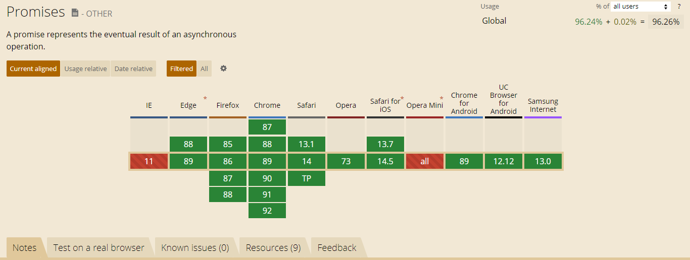

# 浏览器全屏示例

### 背景

之前的代码，由于不同浏览器的原因，每个浏览器全屏要加的前缀都不同。

```javascript
// 检测是否处在全屏状态
    function isFullScreen() {
        return  !!(document.fullscreenElement
            || document.msFullscreenElement
            || document.mozFullScreenElement
            || document.webkitFullscreenElement);
    }

    // 开启全屏模式
    function fullScreen() {
        let html = document.documentElement;
        if(!this.isFullScreen()) {
            if(html.requestFullscreen){
                return html.requestFullscreen();
            }else if(html.webkitRequestFullScreen){
                return html.webkitRequestFullScreen();
            }else if(html.mozRequestFullScreen){
                return html.mozRequestFullScreen();
            }else if(html.msRequestFullscreen){
                return html.msRequestFullscreen();
            }
        }
    }
```

为了简单起见，使用了第三方封装的全屏插件`screenfull.js` ，配合 `es6-promise` 插件，可以兼容IE浏览器。


`screenfull.js` 不支持iPhone 和 IE11- 。


### 示例代码

```markup
<!DOCTYPE html>
<html lang="en">
<head>
    <meta charset="UTF-8">
    <meta http-equiv="X-UA-Compatible" content="IE=edge">
    <meta name="viewport" content="width=device-width, initial-scale=1.0">
    <title>Document</title>
</head>
<body>
    <div>
        是否可以全屏：<span class="detact-screen"></span>

        <button class="on">开启全屏</button>
        <button class="toggle">切换全屏</button>
        <button class="off">退出全屏</button>
    </div>
</body>
<!-- <script src="./screenfull.js"></script>
<script src="./jquery-v1.12.4.js"></script>
<script src="./es6-promise.auto.min.js"></script> -->

<script src="https://cdnjs.cloudflare.com/ajax/libs/screenfull.js/5.1.0/screenfull.min.js"></script>
<script crossorigin="anonymous" integrity="sha384-nvAa0+6Qg9clwYCGGPpDQLVpLNn0fRaROjHqs13t4Ggj3Ez50XnGQqc/r8MhnRDZ" src="https://lib.baomitu.com/jquery/1.12.4/jquery.min.js"></script>
<script src="https://cdn.jsdelivr.net/npm/es6-promise@4/dist/es6-promise.auto.min.js"></script> 
<script>

    // // 移动端 安卓 iOS
    // // 微信手机端
    // // 微信电脑端

    let canFull = screenfull.isEnabled;

    $('.detact-screen').text(canFull ? 'true' : 'false');

    $('.on').on('click', function () {
        screenfull.request();
    })
    $('.toggle').on('click', function () {
        screenfull.toggle();
    })
    $('.off').on('click', function () {
        screenfull.exit();
    })
</script>
</html>
```

### 支持IE11+

由于IE浏览器全线不支持 Promise，所以需要安装 `es6-promise` 插件。




由于其内部使用的仍然是 `Element.requestFullscreen()` ，而其的兼容性**只兼容IE11+**。

所以IE9是无法全屏的。




#### 安装使用1

```text
npm install es6-promise --save
```

然后在 main.js 中引入：

```text
import promise from 'es6-promise';
require('es6-promise').polyfill();
promise.polyfill();
```

### 参考链接

* [https://github.com/sindresorhus/screenfull.js](https://github.com/sindresorhus/screenfull.js)
* [https://github.com/stefanpenner/es6-promise](https://github.com/stefanpenner/es6-promise)
* [vue项目兼容android低版本、兼容IE、ES6解决办法](https://blog.csdn.net/xr510002594/article/details/91378389)

